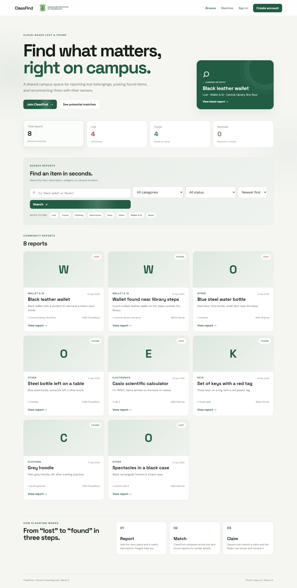
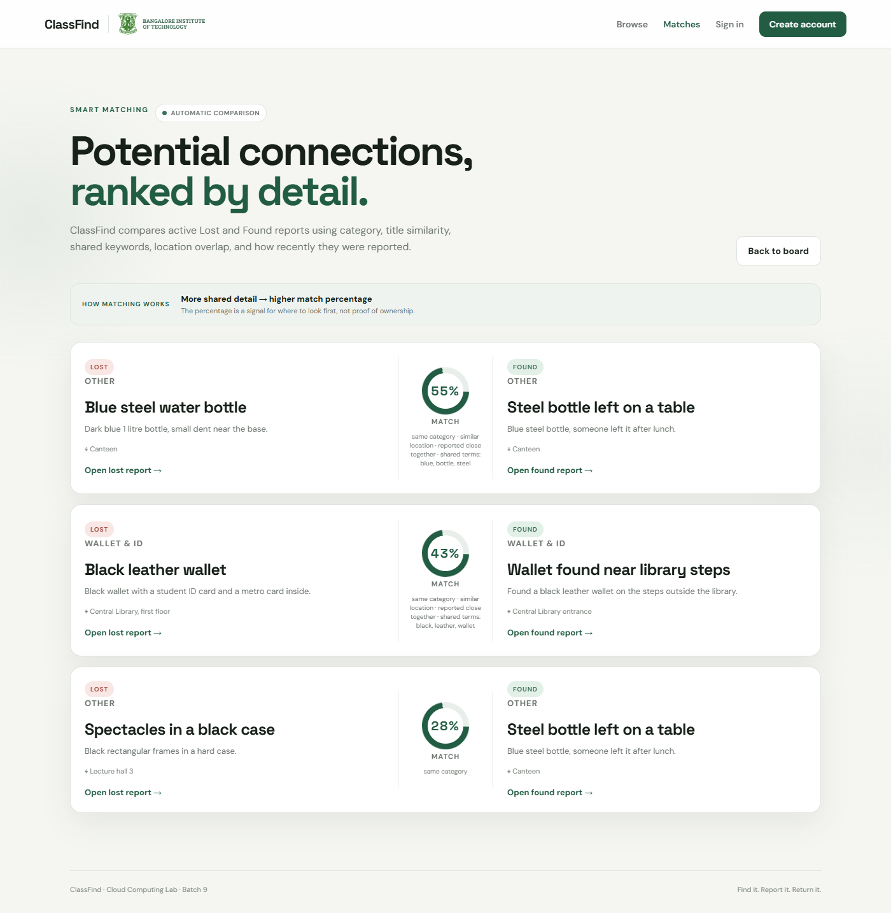
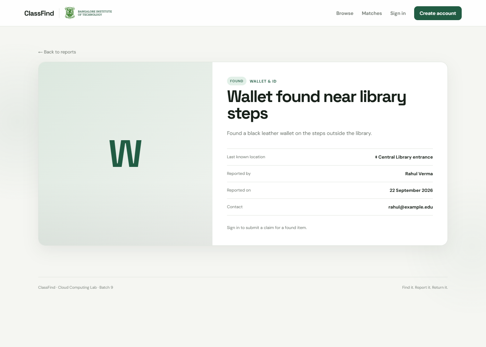

# ClassFind — Campus Lost and Found

[](https://github.com/vidit-16/ClassFind/actions/workflows/ci.yml)
[](LICENSE)
[](https://www.python.org/)

A lost-and-found board for a campus. Students report what they lost or found,
search what others have reported, and claim an item that looks like theirs. The
app compares active Lost and Found reports and shows which pairs look like the
same object, with the reasons for each score.

**Live app:** http://classfind-prod.eba-ttyqcasp.ap-south-1.elasticbeanstalk.com/

<p align="center">
  
</p>
<p align="center"><em>The board: every active report, searchable by keyword, category and status.</em></p>

<p align="center">
  
  
</p>
<p align="center"><em>Potential Lost/Found pairs with the reasons behind each percentage (left). A single report, where the owner can open a claim (right).</em></p>

## What it does

- **Report** a lost or found item, with category, location and an optional photo.
  The reporter's name and contact come from the signed-in account rather than a
  form field, so they cannot be spoofed by whoever fills the form.
- **Search and filter** by keyword, category and status, 24 reports to a page.
- **Claim** a found item. The finder sees the claim, and accepts, rejects or
  waits; the claimant can withdraw it. Accepting a claim resolves the report.
- **Matches** compares every active Lost report against every active Found one
  and lists the pairs worth a look, each with the reasons behind its score.
- **Admin** view over all reports and accounts, for one account named by
  `ADMIN_EMAIL`.
- **Images** go to S3 when a bucket is configured, served through presigned URLs
  so the bucket stays private, and to local disk otherwise.

## How matching works

There is no model here. Each active Lost report is compared with each active
Found report on four signals, and the score is a weighted sum:

| Signal | Weight | How it is measured |
| --- | ---: | --- |
| Shared words in title and description | 0.40 | Jaccard overlap of tokens, stop words removed |
| Title similarity | 0.25 | `difflib.SequenceMatcher` ratio |
| Shared words in location | 0.15 | Jaccard overlap of tokens |
| Reported close together | 0.10 | Falls from 1 to 0 over 14 days |
| Same category | 0.10 | Exact match |

Pairs below 25% are dropped, the rest are shown with their reasons, and equal
scores are ordered by report id so the page does not reshuffle between visits.

Comparing every pair is quadratic, so three things keep the page usable: each
report is tokenised once rather than once per comparison, `SequenceMatcher`'s
own cheap upper bounds skip pairs that cannot reach the cut-off before the
expensive comparison runs, and the result is cached until a report changes. On
seeded data, 600 reports a side went from 31.3s to 19.1s with identical output.
Beyond `MATCH_SCAN_LIMIT` (500 a side) only the newest reports are compared.

## Stack

- **Backend:** Flask, SQLAlchemy
- **Frontend:** Jinja templates, plain CSS and JavaScript, no build step
- **Database:** SQLite locally, PostgreSQL on RDS in the cloud
- **Images:** local disk, or S3 with presigned URLs
- **Deployment:** Elastic Beanstalk with Gunicorn

## Run locally

```bash
git clone https://github.com/vidit-16/ClassFind.git
cd ClassFind
python -m venv .venv
.venv/Scripts/python.exe -m pip install -r requirements.txt   # Windows
.venv/Scripts/python.exe app.py
```

On macOS or Linux, activate the venv and run `pip install -r requirements.txt`
then `python app.py`. The app starts on http://127.0.0.1:5000 and creates
`classfind.db` on first run.

To see the admin pages, set `ADMIN_EMAIL` to the address you register with.
Without `SECRET_KEY` the app generates a random one per process and says so in
the log, which means sessions end when you restart it.

## Configuration

| Variable | Purpose | Default |
| --- | --- | --- |
| `CLASSFIND_ENV` | `production` makes `SECRET_KEY` mandatory | `development` |
| `SECRET_KEY` | Signs session cookies | random per process, outside production |
| `ADMIN_EMAIL` | The one account that gets admin pages | none, so nobody is admin |
| `DATABASE_URL` | SQLite or PostgreSQL connection string | `sqlite:///classfind.db` |
| `S3_BUCKET` | Bucket for uploaded images | unset, images go to local disk |
| `AWS_REGION` | Region for that bucket | `ap-south-1` |
| `COOKIE_SECURE` | Send session cookies only over HTTPS | off |
| `UPLOAD_FOLDER` | Where local images are written | `static/uploads` |

## Deployment

[AWS_DEPLOYMENT.md](AWS_DEPLOYMENT.md) covers the S3 bucket and its policy, the
IAM permissions the instance role needs, RDS, and the Elastic Beanstalk
environment. The short version: set the variables above, push the source
bundle, and check `/health`, which reports the database as well as the app.

## Tests

```bash
.venv/Scripts/python.exe -m unittest discover -s tests -v
```

24 tests, no network and no AWS account needed. They cover registration and
sign-in, reporting, search, the claim workflow end to end, admin access, CSRF
rejection and the security headers, image upload, pagination across two pages,
one account failing to edit another's report, and a check that the fast
matching path returns exactly what a plain double loop returns on the same data.
CI runs them on every push.

## Project structure

```
ClassFind/
├── app.py                  config, models, routes, matching
├── application.py          WSGI entry point for Elastic Beanstalk
├── Procfile                Gunicorn command
├── templates/              Jinja templates, including 400/404/500 pages
├── static/                 style.css, app.js, logo
├── tests/                  test_app.py, test_quality.py
├── aws/                    S3 bucket policy
├── docs/screenshots/       images used in this README
└── .github/workflows/      CI
```

## Known limits

- **Email addresses are not verified.** Anyone can register with any address, so
  the contact on a report proves nothing about who posted it.
- **A claim is a message, not proof.** The finder decides; the app only records
  the exchange.
- **Matching is a hint.** A percentage points at pairs worth checking. It does
  not establish ownership, and it cannot match a report to an item nobody has
  posted yet.
- **The live URL is plain HTTP.** Set `COOKIE_SECURE=1` once the environment is
  behind HTTPS with a certificate.
- **Schema changes are manual.** `create_all()` makes missing tables, and
  `backfill_item_owners()` adds the one column that arrived later. Anything
  further needs a real migration tool.
