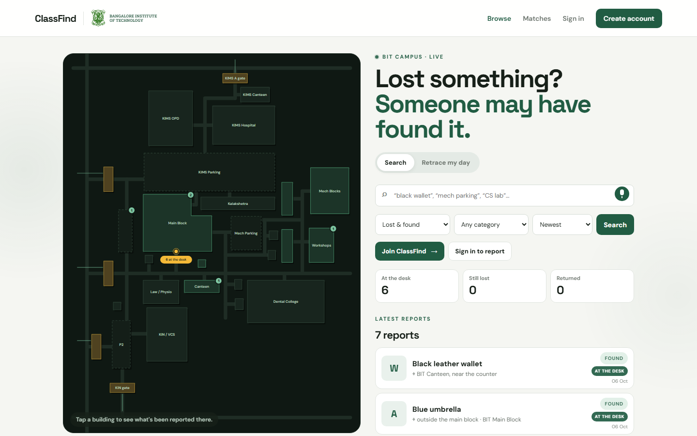
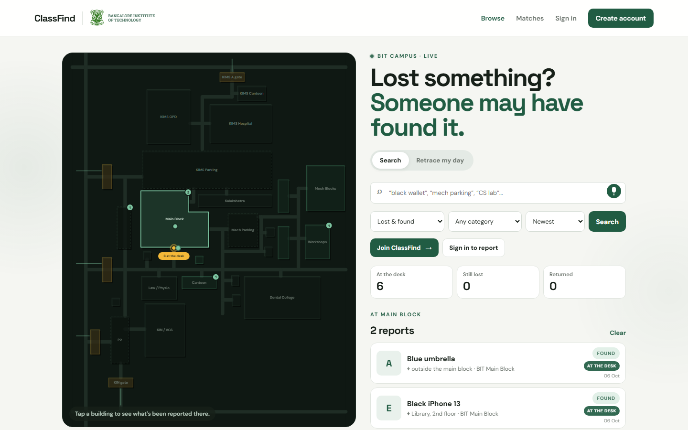
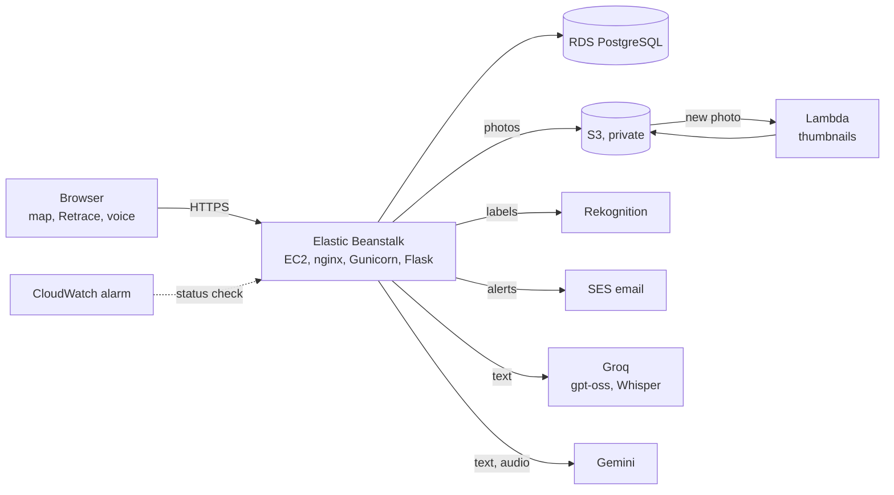

# ClassFind — Campus Lost and Found

[](https://github.com/vidit-16/ClassFind/actions/workflows/ci.yml)
[](LICENSE)
[](https://www.python.org/)

A lost-and-found for the BIT campus, built around a live map. Students report
what they lost or found by tapping where it was, search by place in whatever
words they use, or **retrace their day**: tap or say the places they went and
the app walks that route and shows what was found along it. Found items go to
the security desk, and owners collect them with a one-time code.

**Live app:** https://classfind-prod.eba-ttyqcasp.ap-south-1.elasticbeanstalk.com/

<p align="center">
  
</p>
<p align="center"><em>The home page. Each building shows how many found items are there; the desk shows what it holds.</em></p>

<p align="center">
  
</p>
<p align="center"><em>Tapping a building filters the list to it and drops its reports onto the map. Screenshots use local demo data.</em></p>

## What it does

**Finding things**

- **Campus map.** The home page opens on a map of BIT: 29 places and the paths
  between them, traced from a hand-drawn sketch. Buildings show how many found
  items were reported there, the security desk shows how many it holds, and the
  counts refresh every 20 seconds. The map turns dark in the evening and zooms
  to the building you tap on a phone.
- **Retrace.** "Retrace my day" asks where you went, in order. Tap the places or
  paths and the app draws your walk along the campus paths (shortest route over
  a graph of the paths, preferring paths to cutting through buildings), also
  searches the other likely way, and runs along the route showing what was
  found: anything at the places you went into, and what was found outside the
  places you only walked past.
- **Voice, in any mix of languages.** Say "I lost my black wallet, I was in P1,
  then the canteen, then workshops", in English, Hindi, Kannada, Hinglish or a
  mix. The sentence fills in Retrace, the search box, or the report form, with
  an English item name and a written description.
- **Places from words.** "mech parking", "mechanical parking" and "garage" are
  the same place; "CS lab", "library" and "Canara bank" are the Main Block; the
  ATM outside it is its own place. Misheard words like "mesh parking" or ಕೆಂಟಿನ್
  still match. "Canteen" could be three places, so the app asks which.
- **Search and filter** by keyword, place, category and status, 24 reports to a
  page, updating as you type.
- **Matches** compares every active Lost report against every active Found one
  and lists the pairs worth a look, each with the reasons behind its score.

**Reporting and returning**

- **Report** a lost or found item by typing, by one sentence, or by voice, and
  pick where it was on the map. A place that could be several has to be picked
  before the report is published.
- **Photos** go to S3 through presigned URLs. Amazon Rekognition labels them
  ("Bottle", "Backpack") and the labels count in matching and Retrace. A Lambda
  function makes thumbnails for the home page.
- **Security desk.** Every found item goes to the desk. A student's found report
  shows as awaiting drop-off until staff mark it received. Each item keeps a
  chain of custody: reported, received, claim approved, released, with who did
  each and when. Valuables left unclaimed for 72 hours move to the admin office.
- **Claim** with proof only the owner would know; electronics, wallets and keys
  need a longer proof such as a serial number. Desk staff, not the finder,
  approve or reject claims.
- **Collect with a code.** Approval issues a six-digit code, shown only to the
  claimant and valid for 48 hours. Staff enter it at the desk to release the
  item. It works once, and an item is only released once it has reached the desk.
- **QR tags.** Students print a QR sticker for their things; whoever finds one
  scans it and reports it found in one click, and the owner is emailed.
- **Email alerts** through Amazon SES when a found item looks like your lost one,
  and when a claim is approved or the item is collected.

**Running it**

- **Admin** for the account named by `ADMIN_EMAIL`: every report, insight
  charts, and desk staff. Staff are added by email invitation, which the person
  accepts from their own account within 7 days.
- **AI check.** One button on the admin page tries every configured model and
  shows "working" or the provider's exact error, never the key.

## How sentences and voice are understood

Nothing depends on one provider. Each step has a fallback, and a provider that
is busy or times out is skipped for 3 minutes so requests go straight to the
next one.

| Input | First | Then | Last resort |
| --- | --- | --- | --- |
| Typed sentence | Groq (`gpt-oss-120b`, under a second) | Gemini | Keyword rules, which also read common Hinglish, Kanglish, Devanagari and Kannada |
| Voice clip | Gemini hears the audio itself, best for Kannada and code-mixed speech | Groq Whisper writes it down (prompted with campus names and both scripts), then the text model reads it | The browser's own captions |

The models are given the list of campus places and their other names, and
return the exact spot ("CS lab, 3rd floor") separately from the campus place.
Their output is checked before it reaches the form: categories must be one of
the eight, and an item whose name says its category plainly ("purse") gets it.
If a provider retires its model, the app reads the provider's model list, picks
a current chat model and remembers it.

## How places are matched

`static/campus.json` holds the places, their outlines, about 300 other names,
the paths, and a graph of the paths with the door where each building meets
one. `campus.py` turns text into a place: longest name first, a trailing "lab"
or "block" belongs to the name before it, words like "near" or "outside" mark
the item as outdoors, and loose matching catches typos and misheard speech.
Words that fit several places are never guessed.

## How matching works

Each active Lost report is compared with each active Found report, and the
score is a weighted sum:

| Signal | Weight | How it is measured |
| --- | ---: | --- |
| Shared words in title and description | 0.40 | Jaccard overlap of tokens, stop words removed |
| Title similarity | 0.25 | `difflib.SequenceMatcher` ratio |
| Same place | 0.15 | 1 on the same building or path of the map, else overlap of the location words |
| Reported close together | 0.10 | Falls from 1 to 0 over 14 days |
| Same category | 0.10 | Exact match |
| Photos show the same thing | up to 0.10 | Overlap of the Rekognition labels |

Pairs below 25% are dropped. Each report is tokenised once, `SequenceMatcher`'s
cheap upper bounds skip pairs that cannot reach the cut-off, and the result is
cached until a report changes; on 600 reports a side that took 31.3s down to
19.1s with identical output.

## Architecture


```mermaid
flowchart LR
  B[Browser<br/>map, Retrace, voice] -->|HTTPS| EB[Elastic Beanstalk<br/>EC2, nginx, Gunicorn, Flask]
  EB --> RDS[(RDS PostgreSQL)]
  EB -->|photos| S3[(S3, private)]
  S3 -->|new photo| L[Lambda<br/>thumbnails]
  L --> S3
  EB -->|labels| RK[Rekognition]
  EB -->|alerts| SES[SES email]
  CW[CloudWatch alarm] -.->|status check| EB
  EB -->|text| GQ[Groq<br/>gpt-oss, Whisper]
  EB -->|text, audio| GM[Gemini]
```

## Stack

- **Backend:** Flask, SQLAlchemy, Gunicorn behind nginx
- **Frontend:** Jinja templates, plain CSS and JavaScript, no build step, no
  inline scripts (a strict Content-Security-Policy)
- **Database:** SQLite locally, PostgreSQL on RDS in the cloud
- **AWS:** Elastic Beanstalk, EC2, RDS, S3, Lambda, Rekognition, SES, CloudWatch
- **Models:** Groq (gpt-oss, Whisper) and Google Gemini, all optional

## Run locally

```bash
git clone https://github.com/vidit-16/ClassFind.git
cd ClassFind
python -m venv .venv
.venv/Scripts/python.exe -m pip install -r requirements.txt   # Windows
.venv/Scripts/python.exe app.py
```

On macOS or Linux, activate the venv and run `pip install -r requirements.txt`
then `python app.py`. The app starts on http://127.0.0.1:5000 and creates
`classfind.db` on first run. Set `ADMIN_EMAIL` to the address you register with
to see the admin pages. The microphone needs HTTPS, except on `localhost`.

## Configuration

| Variable | Purpose | Default |
| --- | --- | --- |
| `CLASSFIND_ENV` | `production` makes `SECRET_KEY` mandatory | `development` |
| `SECRET_KEY` | Signs session cookies | random per process, outside production |
| `ADMIN_EMAIL` | The one account that gets admin pages | none |
| `STAFF_EMAILS` | Accounts that work the desk from the start; others are invited from the admin page | none |
| `DATABASE_URL` | SQLite or PostgreSQL connection string | `sqlite:///classfind.db` |
| `S3_BUCKET`, `AWS_REGION` | Bucket for photos, and its region | unset (local disk), `ap-south-1` |
| `PHOTO_LABELS` | Label photos with Amazon Rekognition | off |
| `THUMBNAILS` | Show the Lambda-made thumbnails | off |
| `SES_SENDER` | Verified Amazon SES address for emails | unset, no email |
| `GROQ_API_KEY`, `GEMINI_API_KEY`, `CEREBRAS_API_KEY` | Models for sentences and voice; keyword rules without any | unset |
| `AI_ORDER` | Which text model is asked first | `groq,cerebras,gemini` |
| `GEMINI_MODEL`, `GROQ_MODEL`, `CEREBRAS_MODEL` | Model per provider; a retired one is replaced from the provider's list | `gemini-3.8-flash`, `llama-3.3-70b-versatile`, `llama-3.3-70b` |
| `GEMINI_AUDIO_MODEL`, `WHISPER_MODEL` | Models for voice | `GEMINI_MODEL`, `whisper-large-v3` |
| `ESCALATE_AFTER_HOURS` | Hours a valuable stays at the desk before the admin office | `72` |
| `FORCE_HTTPS` | Redirect HTTP to HTTPS and keep cookies HTTPS-only | off |
| `COOKIE_SECURE` | HTTPS-only cookies without the redirect | off |
| `UPLOAD_FOLDER` | Where local photos are written | `static/uploads` |

## Deployment

[docs/AWS_SETUP_V2.md](docs/AWS_SETUP_V2.md) walks through SES, Rekognition, the
thumbnail Lambda and the CloudWatch alarm. [AWS_DEPLOYMENT.md](AWS_DEPLOYMENT.md)
covers the S3 bucket and its policy, the instance role's permissions, RDS and
the Elastic Beanstalk environment. Set the variables above, deploy the source
bundle (`git archive --format=zip -o classfind.zip HEAD`), then run the smoke
check below.

## Tests

```bash
.venv/Scripts/python.exe -m unittest discover -s tests -v
```

108 tests, with no network or AWS account needed. Besides accounts, reporting,
the desk flow from drop-off to collection code, admin, CSRF, security headers
and uploads, they cover place names (aliases, misspellings, Kannada and Hindi,
places that are ambiguous on purpose), the path graph being fully connected,
Retrace, voice in each mode, every model fallback (busy, retired, timed out),
and a check that the fast matching path returns exactly what a plain double
loop returns.

CI runs the suite twice on every pull request: on SQLite, and on PostgreSQL 16,
the database the live site uses.

Two more checks live in `tools/`:

- **`tools/smoke.py [URL]`** checks a running site from the outside after a
  deploy: health and database engine, HTTPS redirect and security headers, the
  map, place matching, Retrace, and that reporting and admin need a sign-in. It
  only reads, so it is safe on the live site.
- **`tools/mutate.py`** is mutation testing for the code where a quiet bug would
  hurt most: place matching, Retrace, collection codes, escalation and placing
  reports. It makes one small change at a time (a comparison flipped, `and` for
  `or`, a number nudged) and checks that the tests notice.

## Project structure

```
ClassFind/
├── app.py                  config, models, routes, matching, Retrace, voice
├── campus.py               place names → places on the map
├── application.py          WSGI entry point for Elastic Beanstalk
├── templates/              Jinja templates
├── static/                 style.css, app.js, map.js (map and Retrace),
│                           picker.js (map on the report form), voice.js,
│                           campus.json (the map), logo
├── lambda/thumbnail/       the S3-triggered thumbnail function
├── tools/                  build_campus.py, smoke.py, mutate.py
├── tests/                  test_app.py, test_campus.py, test_quality.py,
│                           test_thumbnail_lambda.py
├── docs/                   AWS setup and screenshots
└── .github/workflows/      CI on SQLite and PostgreSQL
```

## Known limits

- **Email addresses are not verified.** Anyone can register with any address.
- **A claim is a message, not proof.** Desk staff check the student's ID at
  handover; the app records who released what.
- **Matching is a hint.** A percentage points at pairs worth checking; it does
  not establish ownership.
- **The map is approximate.** It was traced from a sketch, so distances and
  shapes are close, not surveyed.
- **Retrace uses when an item was reported,** not when it was found.
- **Voice quality depends on the provider.** Gemini handles Kannada and mixed
  speech best but is sometimes slow; Whisper is fast but weaker on Kannada. The
  microphone needs HTTPS, and audio goes to Google or Groq to be understood.
- **Schema changes are small hand-written upgrades** (`add_desk_columns`,
  `add_place_columns`) that run at start-up. Anything bigger needs a real
  migration tool.
